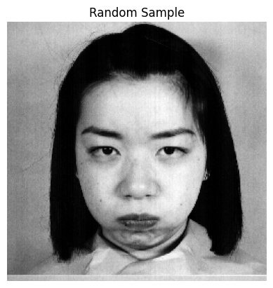
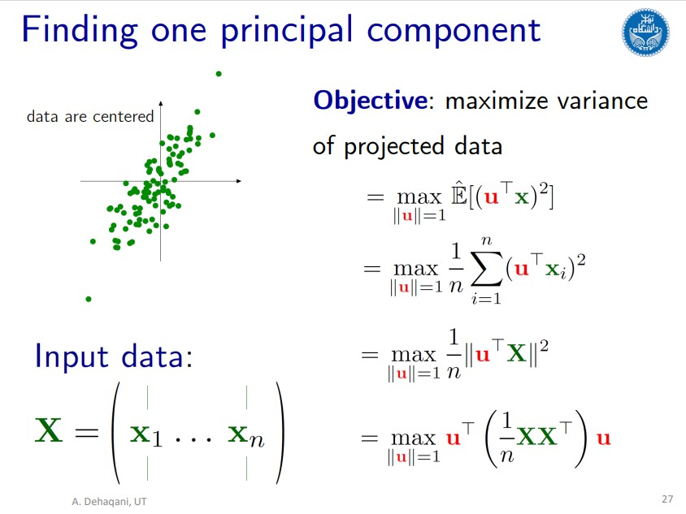
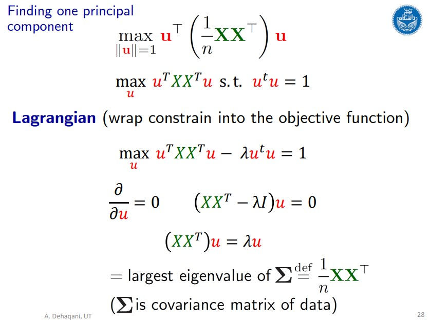
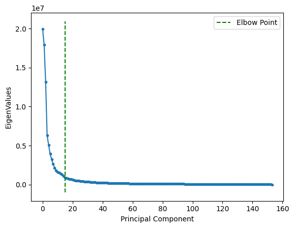
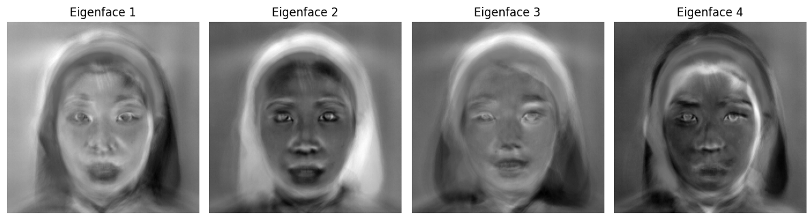
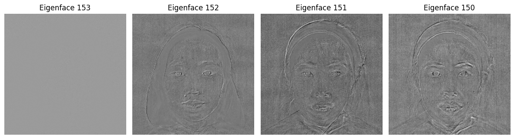

# Principal Component Analysis
A common technique for **image compression** is principal component analysis (PCA). Image quality and compression ratio depend on the number of **principal components**.

Performing PCA on the "[emotion_detection](https://github.com/fardinabbasi/PCA/tree/main/emotion_detection_dateset)" dataset contains 213 images with 6 labels: Happy, Fear, Angry, Disgust, Surprise, and Sad.

### How does PCA work?
First, the original data is **normalized** to have a mean of 0 and a variance of 1.

Next, the normalized data is transformed into another feature space through projection on the **eigenvectors (U)**: $Z = U^T X$.

The procedure for finding U is illustrated below.

    
    

## Best n_components
The **eigenvalues** are presented below in descending order.

The **elbow** method is employed to select the **optimal n_components**, which involves retaining data projections only onto principal components with significant eigenvalues.

## Eigenfaces
Eigenfaces are a set of **eigenvectors** that are used in **facial recognition** and **image compression**.

Below are the first four eigenfaces with the **largest eigenvalues**.

Below are the last four eigenfaces with the **smallest eigenvalues**.

## Course Description
- **Course**: Machine Learning [ECE 501]
- **Semester**: Spring 2023
- **Institution:** [School of Electrical & Computer Engineering](https://ece.ut.ac.ir/en/), [College of Engineering](https://eng.ut.ac.ir/en), [University of Tehran](https://ut.ac.ir/en)
- **Instructors:** Dr. A. Dehaqani, Dr. Tavassolipour
